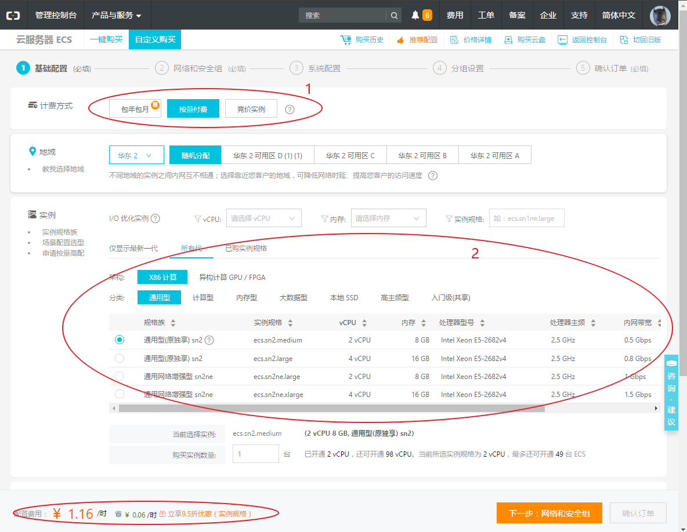

# 阿里云服务器注册与使用手册(简化版)
---
## 准备工作
---
手机下载安装阿里云app:  
注册登录(可以直接使用淘宝或支付宝账号)  
实名认证  
手机绑定  
在“控制台”选项卡选择并开启“虚拟MFA”  
电脑浏览器打开https://www.aliyun.com/  
右上角点击登录。  
  
使用账号或手机登录阿里云  
登录成功之后，右上角点击进入“控制台”  
  
  

---
## 配置并创建服务器
---
点击 ‘云服务器ECS’  
选择 ‘实例’  
选择 服务器所在大区(考虑到网络速度，推荐选择使用者所在区域，此处选择‘华东2’)  
点击 ‘创建实例’  
  
进入云服务器配置页面  
选择 ‘计费方式’  
(其中‘包年包月’适合在公网上建立网站，我们一般做研究计算的，选择‘按量付费’比较划算)  
需要注意的是，‘包年包月’属于一次性付费，‘按量付费’则需要在账户中至少预存100元  
本例只介绍‘按量付费’需要注意的事项  
‘地域’一行默认即可  
‘实例’一行，需要自己选择服务器硬件组合，其中服务器架构分为两大类:‘X86计算’和‘异构计算GPU/FPGA’  
做matlab、数值模拟等计算的同学，选择‘X86计算’即可  
做深度学习的同学，可以选择‘异构计算GPU/FPGA’，区别在于后者可以调用GPU计算卡资源，但是价格也相对较高  
  
关于‘镜像’，可以理解为数据备份，可用于还原操作系统和硬盘数据  
如果需要一套基础操作系统(即没有预装额外计算软件的新系统)，选择‘公共镜像’，推荐选择Windows Server 2016 数据中心版 64位中文版  
‘公共镜像’中没有预装计算软件，需要自己安装，这个过程非常耗时  
我正在维护一个自定义镜像，已经配置好我们实验室常用的软件如:Visual Studio， Matlab， MySQL， Pycharm， Anaconda， Tensorflow等。有需要的同学可以联系我，把镜像共享给你的阿里云账号。 共享之后，你的‘共享镜像’选项卡内就可以选择使用该镜像进行还原了。 该镜像中没有安装的软件，欢迎各位帮忙安装，保证所配环境满足实验室需求。  
‘存储’一行 分为‘系统盘’(即C盘) 和 ‘数据盘’(即D盘) 两部分  
一般我们做科学计算，数据量都不大，只选择系统盘即可，有三种可选，默认‘高效云盘’即可，区别见‘详细说明’，后面填写存储空间需要>40GB  
需要说明的是，上述自定义镜像还原之后已占用系统盘30GB+，因此可以根据自己需要，提高系统盘容量。  
主要配置完成，点击‘下一步:网络和安全组’
  
‘网络和安全组’默认即可，网络带宽可以根据需要选择  
此处注意点击‘系统配置’  
  
‘系统配置’中，默认用户名administrator，设置自己的登录密码(此登录密码即为远程连接的登录密码，不要忘记)  
点击‘确认订单’即完成服务器创建 
  
选择‘按量付费’的此时需要保证账户中至少预存100元  

---
## 服务器登录与使用
---
完成 上述步骤之后，进入‘管理控制台’，在实例的列表中将出现刚刚创建的云服务器，等待服务器完成启动，即可使用
  
使用方式:推荐使用远程桌面连接进行访问
打开本机远程桌面连接(mstsc)，输入列表中实例的公网IP地址，登录用户名默认administrator，密码为刚才设置的登录密码，即可登录该服务器，开始工作  
  
数据可以直接使用剪切板拷贝到服务器上，如果数据量较大，建议提前上传到网盘中，再用服务器下载  

---
## 注意事项
---
‘按量付费’用户，只要服务器处于运行中即开始计时，每小时结算一次，即使服务器关机，由于计算资源(内存和CPU)没有释放，不会结束收费。一般情况下，在计算完成之后，可以点击‘停止’，释放计算资源，此时系统只对硬盘等进行保管，费用比较低  
  
关于‘快照’使用方法：快照是服务器硬盘存储空间的备份，可用于保存系统、软件或者数据。选择‘云盘’，在硬盘列表中可以看到当前创建的实例中的所有硬盘，分为系统盘和数据盘，点击‘创建快照’，可对当前硬盘进行备份。备份时间较长，可以提前释放计算资源，在实例‘停止’状态下进行，在‘快照列表’中可以查看当前创建的所有快照与备份进度。
快照可用于还原磁盘状态，避免误操作。此外，利用快照可以生成‘自定义镜像’，生成的‘自定义镜像’可以用于还原系统，方便下次创建实例之后快速部署环境。
 
‘快照’占用的云盘空间约等于所备份的磁盘中已占用的空间，这部分占用的云盘空间也是收费的，因此请不要保存没有意义的‘快照’。 
计算结束请注意保存数据到本机，远程服务器可能出现宕机的情况，不是家里的服务器，难以保证数据安全。
 

